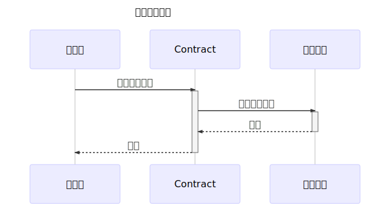

# Implement a voting system with a smart contract

*Read this in other languages: [English](README.en.md), [日本語](README.ja.md).*

## Overview

Implement a voting system using a smart contract

## Main point

- Allow voters to vote without having an ETH address.
- It is an anonymous vote, but it is not an unlimited vote but distributes a ticket for voting in advance.
- In the voting ticket, a character string (voting key) that can be identified by the voter is described and used at the time of voting.
- Use the voting key when voting. Voting keys can only be used once.
- The status of the polls can always be viewed.
- You can set the start and end date and time for voting.

## What can be achieved by this Dapps

Because information is recorded in the block chain, there is no concern such as falsification of the record

## Task

- What to do with the voter's GAS?

## specification

### Create campaign

argument

string _campaignData: Information on the voting campaign. Create in JSON (see below).

uint _optionNumber: Number of choices

uint _voteStartAt: Start timestamp for accepting votes

uint _voteEndAt: Time stamp for end of voting

```json
{
    "question": "What is your favorite drink?",
    "options": ["tea", "coffee", "orange juice", "cola"]
}
```

*Javascript implementation example:*

```js
const data = {
    question: 'What is your favorite drink?',
    options: ['tea', 'coffee', 'orange juice', 'cola'],
};

const _campaignData = JSON.stringify(data);
```

*function*

```solidity
function createCampaign(string _campaignData, uint _optionNumber, uint _voteStartAt, uint _voteEndAt) public returns (bool);
```


### Voter registration

*argument*

bytes32 _campaignId: ID issued at campaign registration

bytes32 [] _voterHashList: `getKeccak256Hash` hashes a unique string identifying the poster and gives it as an array

*Javascript implementation example:*

```javascript
const rawVoter = [ /* Unique string to identify the poster */ ];
const hashedVoter = [];

for (let i = 0; i < rawVoter.length; ++i) {
    // Get hash
    const keccak256Hash = yield contract.methods.getKeccak256Hash(rawVoter[i]).call({});
    hashedVoter.push(keccak256Hash);
}

const _voterHashList = JSON.stringify(hashedVoter);
```

*function*

```solidity
addVoter(bytes32 _campaignId, bytes32[] _voterHashList)
        public
        onlyCampaignOwner(_campaignId)
        beforeVoteStart(_campaignId)
        returns (bool);
```


### Voting

*argument*

bytes32 _campaignId: ID issued at campaign registration

bytes32 _voterHash: A unique string identifying the poster

uint _optionNumber: Number of the option to vote (number starts with zero)

*function*

```solidity
function vote(bytes32 _campaignId, bytes32 _voterHash, uint _optionNumber) public acceptingPolling(_campaignId) returns (bool);
```


### Refer poll results

*argument*

bytes32 _campaignId: ID issued at campaign registration

*function*

```solidity
function getResult(bytes32 _campaignId) public view afterVoteEnd(_campaignId) returns (uint[]);
```



## Implementation

Implementation will be released on GitHub.

https://github.com/PLUSPLUS-JP/crypto-vote
