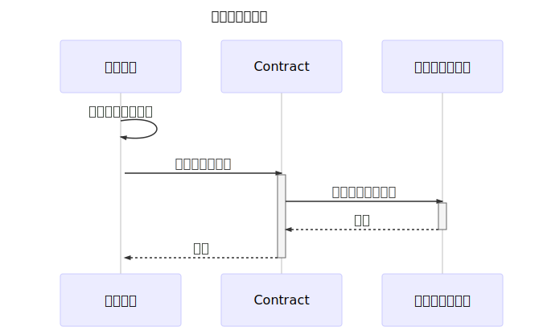

# アンケートをブロックチェーンに作成し投票を受け付けるメカニズム

*Read this in other languages: [English](README.en.md), [日本語](README.ja.md).*

## 概要

スマートコントラクトを使ったアンケートシステムを実装する。

## 要点

- アンケートは質問文と選択肢で構成し、回答期間（開始と終了）を設定する。
- 投票には開始と終了の日時を設定できる。（最低投票期間は1分）
- アンケートへの回答は誰でも行うことができ、EOAアドレスごとに一回だけ回答することができる。
- 回答の状況は常に公開される。
- アンケートの内容をハッシュ化し管理するため、まったく同一の内容は作成できない

## このDappsによって実現できること

ブロックチェーンに情報が記録されるため、記録の改ざんなどの心配がない

## 仕様

### アンケート作成

*引数*

- string `_contents` アンケートの内容（以下にフォーマットを記す）
- uint `_numberOfChoices` 選択肢の個数
- uint `_voteStartAt` 回答を受け付ける開始のタイムスタンプ
- uint `_voteEndAt` 回答を締め切るタイムスタンプ

```json
{
    "question": "あなたの好きな飲みものはなんですか？",
    "options": ["お茶", "コーヒー", "オレンジジュース", "コーラ"]
}
```

*Javascriptでの実装例：*

```js
const data = {
    question: 'あなたの好きな飲みものはなんですか？',
    options: ['お茶', 'コーヒー', 'オレンジジュース', 'コーラ'],
};

const _contents = JSON.stringify(data);
```

*関数*

```solidity
function create(string memory _contents, uint _numberOfChoices, uint _voteStartAt, uint _voteEndAt) public onlyOwner returns (bool) { ... }
```




### 投票

*引数*

- bytes32 `_id` アンケートのID
- uint `_choice` 投票する選択肢の番号（番号はゼロ始まり）

*関数*

```solidity
function vote(bytes32 _id, uint _choice) public acceptingVoting(_id) returns (bool) { ... }
```


### 投票結果参照

*引数*

- bytes32 `_id` アンケートのID

*関数*

```solidity
function getResult(bytes32 _id) public view returns (uint[] memory) { ... }
```


## 実装

実装はGitHubにて公開する。

https://github.com/PLUSPLUS-JP/crypto-vote
